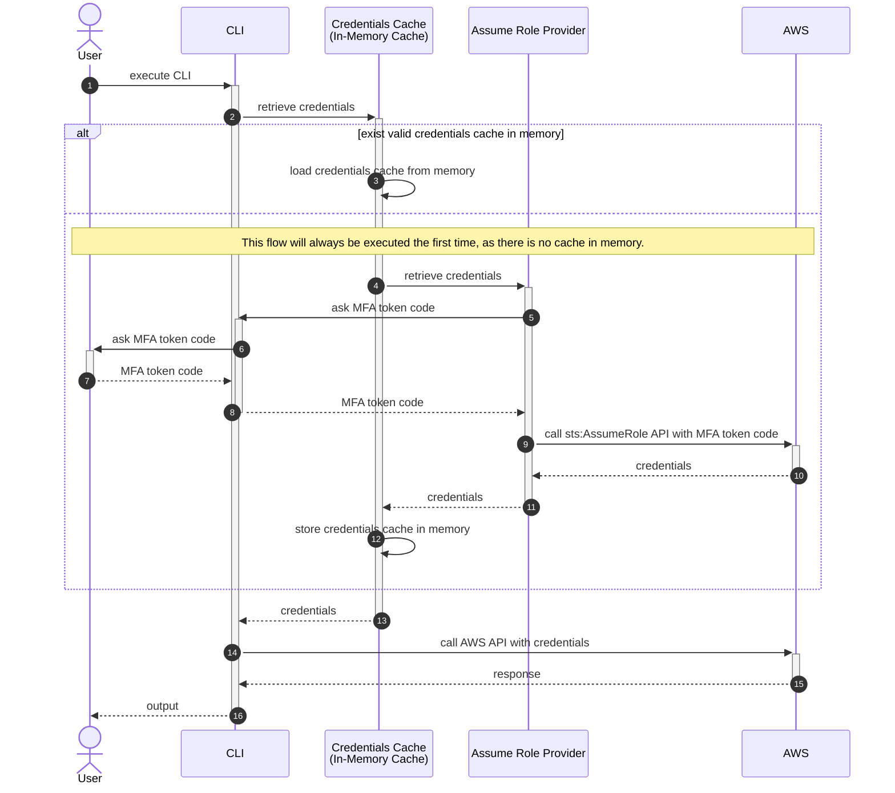
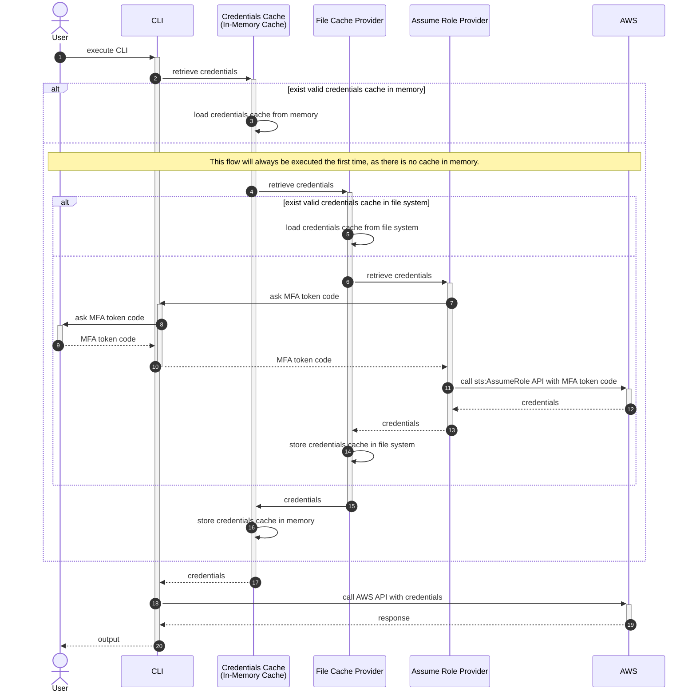

# CLI

## Setup

### go mod

```shell
go mod tidy
```

### AWS Config

Edit `~/.aws/config` as needed.

```ini
[profile myprofile]
source_profile = default
mfa_serial = arn:aws:iam::123456789012:mfa/myname
role_arn = arn:aws:iam::123456789012:role/myrole
role_session_name = myname
region = us-east-1
output = json
```

## Run commands

### `sdkv2`

#### `sdkv2 nocache`

An MFA token code will be requested every time you run it.
This is a very common problem with CLIs using the AWS SDK v2.




#### `sdkv2 cache`

A credentials cache can be shared between processes.


It can also be shared with the AWS CLI.




### `sdkv1`

The concept is the same as SDK v2.

#### `sdkv1 nocache`


#### `sdkv1 cache`


